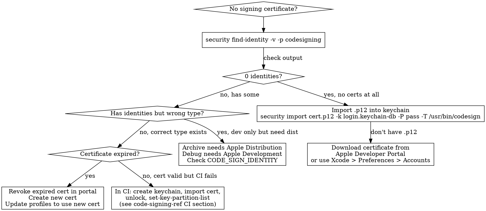
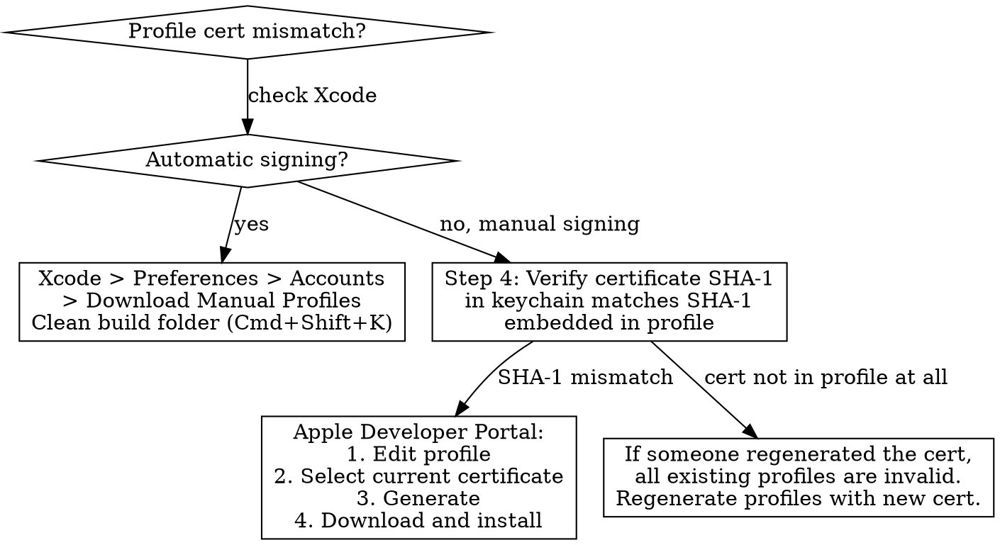
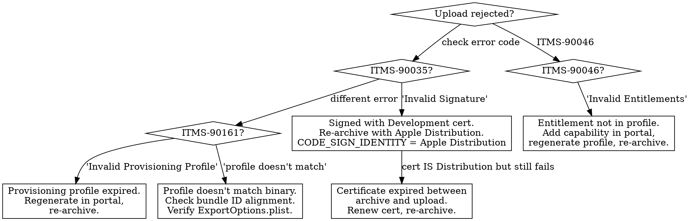
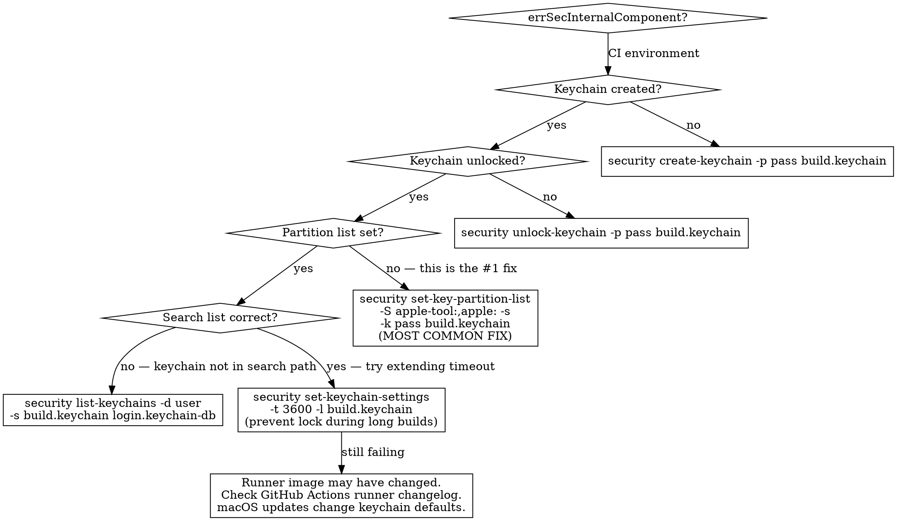
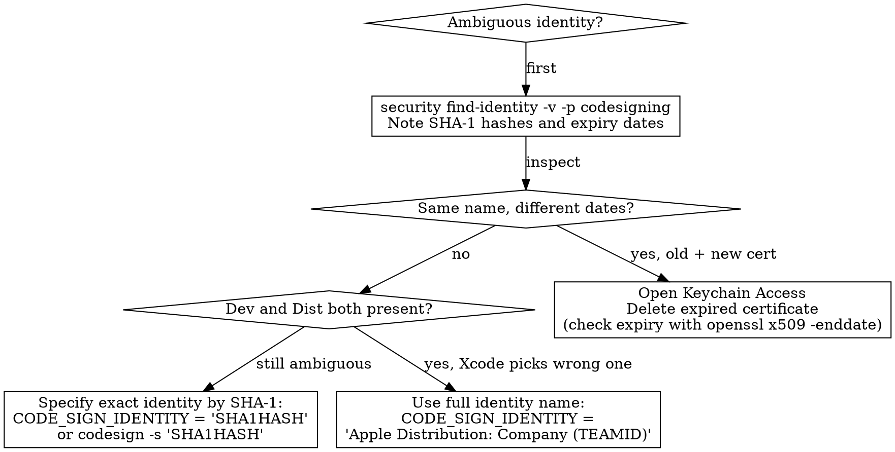
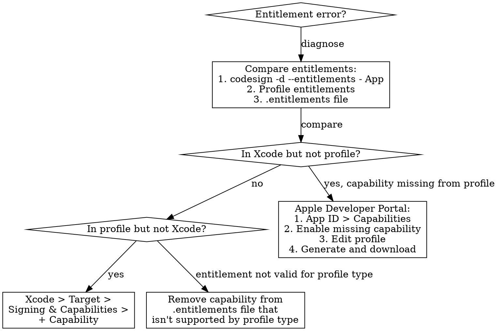

# Code Signing Diagnostics

Systematic troubleshooting for code signing failures: missing certificates, provisioning profile mismatches, Keychain issues in CI, entitlement conflicts, and App Store upload rejections.

## Overview

**Core Principle**: When code signing fails, the problem is usually:
1. **Certificate issues** (expired, missing, wrong type, revoked) — 30%
2. **Provisioning profile issues** (expired, missing cert, wrong App ID, missing capability) — 25%
3. **Entitlement mismatches** (capability in Xcode but not in profile, or vice versa) — 15%
4. **Keychain issues** (locked in CI, errSecInternalComponent, partition list) — 15%
5. **Archive/export issues** (wrong export method, wrong cert type for distribution) — 10%
6. **Ambiguous identity** (multiple matching certificates, Xcode picks wrong one) — 5%

**Always verify certificate + profile + entitlements BEFORE rewriting build settings or regenerating everything.**

## Red Flags

Symptoms that indicate code signing–specific issues:

| Symptom | Likely Cause |
|---------|--------------|
| "No signing certificate found" | Certificate expired, revoked, or not in keychain |
| "Provisioning profile doesn't include signing certificate" | Profile generated with different cert than the one in keychain |
| ITMS-90035 Invalid Signature | Signed with Development cert instead of Distribution |
| ITMS-90161 Invalid Provisioning Profile | Profile expired or doesn't match binary |
| errSecInternalComponent in CI | Keychain locked or `set-key-partition-list` not called |
| "Ambiguous — matches multiple" | Multiple valid certs with same name (dev + expired) |
| "Entitlement not allowed by profile" | Capability added in Xcode but profile not regenerated |
| "codesign wants to access key" dialog | Keychain access not granted to codesign |
| Build works locally, fails in CI | Missing keychain setup steps (create, unlock, partition list) |
| "Profile doesn't match bundle ID" | Bundle identifier mismatch between Xcode target and profile |
| Export fails after successful archive | ExportOptions.plist specifies wrong method or profile |
| App extension signing fails | Extension needs its own profile with matching team and prefix |

## Anti-Rationalization

| Rationalization | Why It Fails | Time Cost |
|----------------|--------------|-----------|
| "Certificate was fine yesterday" | Certificates expire and get revoked. Profiles auto-regenerate in portal changes. Always re-verify. | 30-60 min debugging build settings when cert expired overnight |
| "Let me regenerate everything" | Regenerating certificates revokes the old ones, breaking other team members and CI. Diagnose first. | 2-4 hours + broken teammates + CI pipeline down |
| "I'll reset my keychain" | Destroys ALL stored credentials (SSH keys, saved passwords, other certs). Diagnose the specific cert. | 1-2 hours restoring all credentials |
| "Just disable code signing for now" | Code signing can't be disabled for device builds or distribution. You'll hit the same issue later with less time. | Wasted time plus the original problem remains |
| "It's an Xcode bug, let me reinstall" | Code signing is configuration, not an Xcode bug. Reinstalling doesn't change your certificates or profiles. | 2-4 hours reinstalling Xcode while the config stays broken |
| "I'll use the team provisioning profile" | Xcode's auto-managed wildcard profile lacks specific entitlements (push, App Groups). It won't work for apps needing capabilities. | 30+ min discovering missing capabilities |
| "CI worked before, nothing changed on our side" | Apple revokes certificates for security reasons. CI runner macOS updates change keychain behavior. Provisioning profiles expire after 1 year. | Hours of "but we didn't change anything" while the cert is expired |
| "Let me check the code first" | Code signing errors are NEVER code bugs. They are 100% configuration — certificates, profiles, entitlements, and keychains. | Hours debugging working code while the profile is expired |
| "Set build.keychain as default" | `security default-keychain -s build.keychain` replaces the login keychain as default, breaking access to SSH keys, saved passwords, and other credentials. Use `list-keychains -s` instead. | 30+ min restoring default keychain + mysterious SSH/credential failures |

## Mandatory First Steps

Before changing build settings or regenerating certificates, run these diagnostics:

### Step 1: Check Signing Identities

```bash
security find-identity -v -p codesigning
```

**Expected output**:
- At least one valid identity with "Apple Development" or "Apple Distribution"
- Each shows SHA-1 hash + name + Team ID

**Problems**:
- 0 valid identities → No certificates installed or all expired
- Only "Apple Development" but trying to archive → Need Distribution certificate
- Multiple entries with same name → Ambiguous identity (see Tree 5)

### Step 2: Decode Provisioning Profile

```bash
# Find the profile being used
find ~/Library/Developer/Xcode/DerivedData -name "embedded.mobileprovision" -newer . 2>/dev/null | head -3

# Decode it
security cms -D -i path/to/embedded.mobileprovision
```

**Check these fields**:
- `ExpirationDate` → Not expired?
- `DeveloperCertificates` → Contains your current certificate?
- `Entitlements` → Contains all capabilities your app uses?
- `ProvisionedDevices` → Contains your test device UDID? (Development/Ad Hoc only)
- `Name` → Matches what Xcode is configured to use?

### Step 3: Extract and Compare Entitlements

```bash
# What entitlements does the built app have?
codesign -d --entitlements - /path/to/MyApp.app

# What entitlements does the profile grant?
security cms -D -i embedded.mobileprovision | plutil -extract Entitlements xml1 -o - -

# What entitlements does Xcode's .entitlements file declare?
cat MyApp/MyApp.entitlements
```

**All three must agree.** Any mismatch → signing failure.

### Step 4: Verify Certificate in Profile

```bash
# Get certificate SHA-1 from keychain
security find-identity -v -p codesigning | grep "Apple Distribution"
# Output: 1) ABCDEF123... "Apple Distribution: Company (TEAMID)"

# Check if that certificate is embedded in the profile
security cms -D -i embedded.mobileprovision | plutil -extract DeveloperCertificates xml1 -o - -
# Decode one of the base64 certificates:
echo "<base64 data>" | base64 -d | openssl x509 -inform DER -noout -fingerprint -sha1
```

The SHA-1 from the profile must match the SHA-1 from `find-identity`.

## Decision Trees

### Tree 1: "No signing certificate found"



### Tree 2: "Provisioning profile doesn't include signing certificate"



### Tree 3: ITMS-90035/90161 Invalid Signature/Profile



### Tree 4: errSecInternalComponent / Keychain Locked in CI



### Tree 5: Ambiguous Identity / Multiple Certificates



### Tree 6: Entitlement Mismatch / Missing Capability



## Quick Reference Table

| Symptom | Check | Fix |
|---------|-------|-----|
| No signing certificate found | `security find-identity -v -p codesigning` | Import cert or download from portal |
| Provisioning profile doesn't include cert | Step 4: SHA-1 comparison | Regenerate profile with current cert |
| ITMS-90035 Invalid Signature | `codesign -dv` on archived app | Re-archive with Apple Distribution cert |
| ITMS-90161 Invalid Provisioning Profile | `security cms -D -i` on profile | Regenerate non-expired profile |
| ITMS-90046 Invalid Entitlements | Step 3: three-way comparison | Add capability in portal, regenerate profile |
| errSecInternalComponent | CI keychain setup | `set-key-partition-list` (most common fix) |
| Ambiguous identity | `security find-identity -v` count | Delete expired cert or use SHA-1 hash |
| Entitlement mismatch | Three-way entitlement comparison | Align Xcode, profile, and .entitlements |
| Profile expired | `security cms -D` check ExpirationDate | Download fresh profile from portal |
| Profile missing push | `grep aps-environment` in profile | Enable Push in portal, regenerate profile |
| Extension signing fails | Extension target signing config | Each extension needs own profile with matching team |
| Works locally, fails CI | CI keychain script completeness | Full setup: create, unlock, import, partition list, search list |
| "codesign wants to access key" | Keychain access settings | `security set-key-partition-list` or Keychain Access > Get Info > Access Control |
| App Groups entitlement error | Three-way comparison | Add App Group in portal App ID, regenerate profile |
| Build works, export fails | ExportOptions.plist | Verify method, profile name, team ID in plist |

## Pressure Scenarios

### Scenario 1: "Just regenerate everything"

**Context**: Code signing fails. Team member suggests revoking all certificates and generating new ones to start fresh.

**Pressure**: "It'll only take 5 minutes to regenerate everything."

**Reality**: Revoking a distribution certificate invalidates ALL provisioning profiles that use it — across ALL team members and CI systems. Every developer needs new certificates. Every CI pipeline breaks. Every profile needs regeneration. The "5 minute fix" becomes a 2-4 hour team-wide outage.

**Correct action**: Diagnose the specific issue with Steps 1-4. Most signing failures are a single expired or mismatched component, not a systemic problem.

**Push-back template**: "Revoking certificates breaks signing for everyone on the team and all CI pipelines. Let me run the diagnostic steps first — 90% of signing issues are a single expired cert or mismatched profile, fixable in 5 minutes without affecting anyone else."

### Scenario 2: "Xcode updated, signing broke — rollback"

**Context**: After an Xcode update, code signing stopped working. Someone suggests rolling back Xcode.

**Pressure**: "The build worked before the update, so the update broke it."

**Reality**: Xcode updates sometimes invalidate managed signing caches or change how automatic signing selects profiles. But the certificates and profiles themselves don't change. Rolling back Xcode loses access to new SDK features and doesn't fix the underlying configuration.

**Correct action**: Run Steps 1-2 to verify certificates and profiles are still valid. Check if Xcode's automatic signing is selecting a different profile. Try: Xcode → Preferences → Accounts → Download Manual Profiles. Clean build folder.

**Push-back template**: "Xcode updates don't change our certificates or profiles. Let me check what Xcode's automatic signing is selecting now — it's likely picking a different profile than before. A 5-minute check will tell us exactly what changed."

### Scenario 3: "The archive failed, let me re-archive — it's probably corruption"

**Context**: Archive succeeded but export or upload failed. Developer wants to re-archive assuming the archive was corrupted.

**Pressure**: "Just do it again, it'll probably work this time."

**Reality**: Archive "corruption" is extremely rare. Export failures are almost always: wrong ExportOptions.plist method, wrong certificate type in the archive, or profile mismatch. Re-archiving with the same settings produces the same result.

**Correct action**: Inspect the archive before re-building:
1. `codesign -dv` on the .app inside the .xcarchive to see what signed it
2. Check ExportOptions.plist method matches intent (app-store, ad-hoc, etc.)
3. Verify the profile specified in ExportOptions exists and isn't expired

**Push-back template**: "Re-archiving with the same settings will produce the same result. Let me check what's actually in the archive — it takes 30 seconds with codesign -dv and will tell us exactly why export failed."

## Checklist

Before declaring a signing issue fixed:

- [ ] `security find-identity -v -p codesigning` shows the expected identity
- [ ] Profile decoded with `security cms -D` — not expired, contains correct cert
- [ ] Three-way entitlement comparison agrees (binary, profile, .entitlements file)
- [ ] Build/archive succeeds with correct `CODE_SIGN_IDENTITY`
- [ ] If CI: keychain created, unlocked, partition list set, cert imported
- [ ] If CI: cleanup step runs on success AND failure

## Resources

**WWDC**: 2021-10204, 2022-110353

**Docs**: /security, /bundleresources/entitlements, /xcode/distributing-your-app

**Skills**: axiom-code-signing, axiom-code-signing-ref
