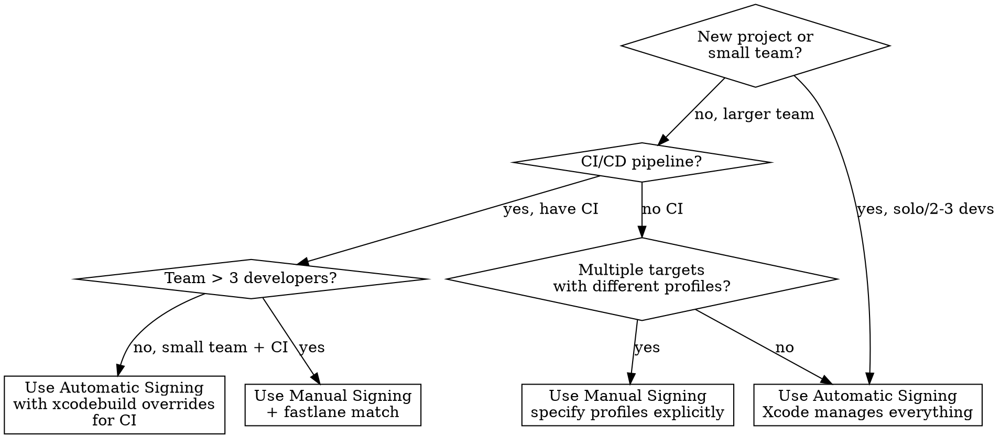

# Code Signing

Certificate management, provisioning profiles, entitlements configuration, CI/CD signing setup, and distribution build preparation for iOS/macOS apps.

## When to Use This Skill

Use when you need to:
- ☑ Set up code signing for a new project or CI/CD pipeline
- ☑ Debug any code signing error (certificate, profile, entitlement, Keychain)
- ☑ Configure signing for App Store, TestFlight, or Ad Hoc distribution
- ☑ Manage certificates and profiles across a team
- ☑ Set up fastlane match for team-wide certificate management
- ☑ Understand automatic vs manual signing tradeoffs
- ☑ Add a new capability that requires entitlement changes
- ☑ Fix CI/CD signing failures (errSecInternalComponent, locked keychain)

## Example Prompts

"How do I set up code signing for my app?"
"My build fails with 'No signing certificate found'"
"How do I set up fastlane match for my team?"
"errSecInternalComponent in GitHub Actions"
"ITMS-90035 when uploading to App Store"
"How do I add push notification entitlements?"
"Multiple certificates match — ambiguous identity"
"Code signing works locally but fails in CI"
"How do I sign for App Store distribution?"
"My provisioning profile expired, what do I do?"

## Red Flags

Signs you're making this harder than it needs to be:

- ❌ Sharing certificates via Slack/email — .p12 files in chat create security risks and version confusion. Use fastlane match or Xcode's automatic signing.
- ❌ Disabling code signing to "fix" a build — Code signing can't be disabled for device or distribution builds. The error will return.
- ❌ Committing .p12 or .mobileprovision to git — These are secrets. Use CI secrets management (GitHub Secrets, environment variables).
- ❌ Regenerating all certificates "to be safe" — Revokes existing certs, breaking every team member and CI pipeline.
- ❌ Using a personal certificate for team/CI builds — When that person leaves or their cert expires, everything breaks.
- ❌ Ignoring "profile doesn't include signing certificate" warnings — This always becomes a build failure. Fix it now.
- ❌ Setting `CODE_SIGN_IDENTITY = ""` to suppress errors — Defers the problem to archive/export where it's harder to debug.
- ❌ Manually managing profiles for automatic-signing projects — Pick one approach. Mixing causes conflicts.

## Mandatory First Steps

Before configuring or debugging any code signing issue:

### 1. List Available Signing Identities

```bash
security find-identity -v -p codesigning
```

This tells you what certificates are installed, valid, and available for signing.

### 2. Decode the Provisioning Profile

```bash
# Find profile embedded in most recent build
find ~/Library/Developer/Xcode/DerivedData -name "embedded.mobileprovision" -newer . 2>/dev/null | head -3

# Decode it
security cms -D -i path/to/embedded.mobileprovision
```

Check: expiration, embedded certificates, entitlements, device list.

### 3. Extract Entitlements from the Binary

```bash
codesign -d --entitlements - /path/to/MyApp.app
```

Compare these against the profile's entitlements and your .entitlements file. All three must agree.

### 4. Verify Certificate in Profile

```bash
# Get SHA-1 from keychain
security find-identity -v -p codesigning | grep "Apple Distribution"
# Output: 1) ABCDEF123... "Apple Distribution: Company (TEAMID)"

# Get SHA-1 from profile
security cms -D -i embedded.mobileprovision | plutil -extract DeveloperCertificates xml1 -o - -
echo "<base64 data>" | base64 -d | openssl x509 -inform DER -noout -fingerprint -sha1
```

The SHA-1 hashes must match. If they don't, the profile was generated with a different certificate than the one in your keychain.

## Automatic vs Manual Signing



### Automatic Signing

**Best for**: Solo developers, small teams, projects without CI.

Xcode manages certificates and provisioning profiles automatically. You just select a team.

```
Xcode → Target → Signing & Capabilities → ✓ Automatically manage signing → Select Team
```

**How it works**:
- Xcode creates/downloads certificates as needed
- Generates provisioning profiles that match your capabilities
- Regenerates profiles when you add/remove capabilities
- Registers devices when you connect them

**Limitations**:
- Only one developer's cert per machine (can conflict in teams)
- CI requires `xcodebuild` overrides or Xcode Cloud
- Can't share profiles across team members easily
- May select unexpected profile if multiple are available

### Manual Signing

**Best for**: Teams, CI/CD pipelines, apps with multiple targets/extensions.

You explicitly specify which certificate and profile to use.

```
Xcode → Target → Signing & Capabilities → ✗ Automatically manage signing
→ Select Provisioning Profile for each configuration (Debug/Release)
```

**How it works**:
- You create certificates and profiles in Apple Developer Portal
- Download and install profiles manually (or use match)
- Specify exact profile in Xcode or xcodebuild
- Full control over which cert/profile combination is used

**Required build settings**:
```
CODE_SIGN_STYLE = Manual
CODE_SIGN_IDENTITY = Apple Distribution: Company Name (TEAMID)
PROVISIONING_PROFILE_SPECIFIER = MyApp App Store Profile
DEVELOPMENT_TEAM = YOURTEAMID
```

## Certificate Types and Lifecycle

### Certificate Type Selection

| Scenario | Certificate Type | Notes |
|----------|-----------------|-------|
| Debug build on device | Apple Development | Auto-created by Xcode |
| TestFlight / App Store | Apple Distribution | 3 max per account |
| Ad Hoc distribution | Apple Distribution | Same cert, different profile type |
| macOS outside App Store | Developer ID Application | 5-year validity |

### Certificate Renewal Workflow

Certificates expire after 1 year (5 years for Developer ID). When a cert expires:

1. **Don't revoke the expired cert** — it's already expired; revoking removes it from the portal and invalidates any profiles still referencing it
2. Create a new certificate in Apple Developer Portal
3. Download and install the new certificate
4. Edit ALL provisioning profiles that used the old cert → select the new cert → regenerate
5. Download and install updated profiles
6. Update CI with the new .p12 and profiles
7. If using fastlane match: `fastlane match nuke [type]` then `fastlane match [type]`

**Team coordination**: Notify the team before regenerating. Distribution certs are shared — regenerating one affects everyone.

## Provisioning Profile Patterns

### Development Profile

For debug builds on registered devices:

- Contains: Development certificate + registered device UDIDs + App ID + entitlements
- Created: Automatically by Xcode (automatic signing) or manually in portal
- Devices: Must be explicitly registered in portal (100 device limit per type per year)

### Ad Hoc Profile

For testing on specific devices without TestFlight:

- Contains: Distribution certificate + registered device UDIDs + App ID + entitlements
- Use case: QA testing, client demos, beta testing without TestFlight
- Limitation: Same 100-device annual limit as Development

### App Store Profile

For TestFlight and App Store submission:

- Contains: Distribution certificate + App ID + entitlements (NO device list)
- No device limit — TestFlight supports up to 10,000 testers
- Required for Xcode Organizer upload or `xcodebuild -exportArchive`

### Enterprise Profile

For in-house distribution (Apple Developer Enterprise Program only):

- Contains: Enterprise certificate + App ID + entitlements (NO device list)
- Distribute internally without device registration
- Cannot submit to App Store
- Apple audits for compliance — misuse (distributing to public) results in program termination

## Entitlements Configuration

### Adding a New Capability

1. **Apple Developer Portal**: App IDs → Select your App ID → Capabilities → Enable the capability
2. **Xcode**: Target → Signing & Capabilities → + Capability → Select capability
3. **Regenerate profile**: If using manual signing, edit the provisioning profile to include the new capability, then generate and download

If using automatic signing, Xcode handles steps 1 and 3 automatically.

### Common Capability → Entitlement Mapping

| Capability | Entitlement Key | Profile Requirement |
|-----------|-----------------|---------------------|
| Push Notifications | `aps-environment` | Must be in profile |
| App Groups | `com.apple.security.application-groups` | Must be in profile |
| Associated Domains | `com.apple.developer.associated-domains` | Must be in profile |
| Sign in with Apple | `com.apple.developer.applesignin` | Must be in profile |
| HealthKit | `com.apple.developer.healthkit` | Must be in profile |
| iCloud | `com.apple.developer.icloud-*` | Must be in profile |
| In-App Purchase | Automatic | No profile change needed |
| Background Modes | `UIBackgroundModes` (Info.plist) | No profile change needed |
| Keychain Sharing | `keychain-access-groups` | Must be in profile |

### Multi-Target Entitlements

Each target (app, widget, extension, etc.) needs its own:
- App ID in the Developer Portal
- Provisioning profile
- .entitlements file

All targets must share the same Team ID. App Groups enable data sharing between targets.

```
com.example.app                  → MyApp.entitlements
com.example.app.widget           → Widget/Widget.entitlements
com.example.app.NotificationService → NotificationService/NotificationService.entitlements
```

## CI/CD Signing Setup

### Without fastlane (raw scripts)

See `axiom-code-signing-ref` for complete CI keychain scripts. The critical steps:

1. **Create** temporary keychain
2. **Add to search list** (include login.keychain-db) — do NOT use `default-keychain -s` as it breaks access to login keychain credentials
3. **Unlock** keychain
4. **Import** .p12 certificate
5. **Set partition list** (prevents errSecInternalComponent)
6. **Install** provisioning profile to `~/Library/MobileDevice/Provisioning Profiles/`
7. **Build/archive** with explicit signing settings
8. **Cleanup** — delete temporary keychain (always, even on failure)

### With fastlane match

fastlane match manages certificates and profiles in a shared git repo (or cloud storage), encrypted with a passphrase.

**Initial setup** (run once by a team admin):
```bash
fastlane match init              # Choose storage (git, google_cloud, s3)
fastlane match development       # Generate dev certs + profiles
fastlane match appstore          # Generate distribution certs + profiles
```

**CI usage** (readonly — never generate in CI):
```ruby
# Fastfile
lane :release do
  setup_ci                        # Creates temporary keychain
  match(type: "appstore", readonly: true)
  build_app(scheme: "MyApp", export_method: "app-store")
end
```

**Key rules**:
- CI must use `readonly: true` — never generate certificates from CI
- Set `MATCH_PASSWORD` as a CI secret (encrypts/decrypts the cert repo)
- Use `setup_ci` to create a temporary keychain (handles all keychain setup)
- Each app target needs its own `app_identifier` in Matchfile

### Xcode Cloud

Xcode Cloud handles signing automatically:
- No certificate management needed — Apple manages signing infrastructure
- Configure in Xcode → Product → Xcode Cloud → Manage Workflows
- Use `ci_post_clone.sh` for custom setup (SPM auth, certificates from custom sources)
- Distribution signing is handled during the "Archive" action

## Anti-Patterns

### Anti-Pattern 1: Sharing .p12 via Chat

**Wrong**:
```
Slack: "Hey, here's the distribution cert 📎 cert.p12, password is Company123"
```

**Right**: Use fastlane match (encrypted git repo) or Xcode's automatic signing with a shared team account.

**Why it matters**: .p12 files shared in chat create security risks (credentials in chat history), version confusion (which cert is current?), and single-point-of-failure (if the sender's cert expires or is revoked). Time cost: 1-2 hours per team member when the shared cert breaks.

### Anti-Pattern 2: Committing Secrets to Git

**Wrong**:
```
git add certificates/distribution.p12
git add profiles/AppStore.mobileprovision
git commit -m "Add signing files"
```

**Right**: Use CI secrets management:
```bash
# GitHub Actions
echo "$P12_BASE64" | base64 --decode > certificate.p12   # From secrets
echo "$PROFILE_BASE64" | base64 --decode > profile.mobileprovision
```

**Why it matters**: Certificates and profiles are secrets — they allow anyone to sign apps as your team. Even in private repos, git history is permanent. Once committed, the credential is in every clone forever.

**If already committed**: Scrub history with `git filter-repo --path path/to/cert.p12 --invert-paths`, then rotate the compromised certificate (revoke in portal, create new, update CI secrets). Every existing clone still has the old cert — treat it as compromised.

### Anti-Pattern 3: "Fix" Signing by Disabling It

**Wrong**:
```
CODE_SIGN_IDENTITY = ""
CODE_SIGNING_REQUIRED = NO
CODE_SIGNING_ALLOWED = NO
```

**Right**: Diagnose the actual signing error with the mandatory diagnostic steps.

**Why it matters**: Disabling code signing "works" for Simulator builds but fails for device builds, archives, and distribution. The problem is deferred to a point where it's harder to debug and closer to a deadline. Time cost: the original issue plus 30+ minutes of export/upload debugging.

### Anti-Pattern 4: Using Personal Cert for Team/CI

**Wrong**:
```
# CI pipeline uses one developer's personal certificate
security import ~/charles-personal.p12 ...
CODE_SIGN_IDENTITY = "Apple Distribution: Charles Personal (ABC123)"
```

**Right**: Use a dedicated team certificate managed via fastlane match or a shared Apple Developer account:
```ruby
match(type: "appstore", readonly: true)
```

**Why it matters**: When that developer leaves, changes machines, or their cert expires, CI and all team distribution breaks. One person's personal cert should never be a shared infrastructure dependency. Time cost: 2-4 hours of emergency cert rotation when the person is unavailable.

## Pressure Scenarios

### Scenario 1: "Just disable code signing so we can ship today"

**Context**: Build deadline approaching, code signing error blocking the archive.

**Pressure**: "We don't need signing for testing, just disable it and we'll fix it after release."

**Reality**: You can't submit to TestFlight or the App Store without valid code signing. Disabling it now defers a blocking issue to the most time-pressured moment — the actual submission. The diagnostic steps take 5-10 minutes and will identify the root cause.

**Correct action**: Run Steps 1-4 from Mandatory First Steps. Most signing issues are a single expired or mismatched component.

**Push-back template**: "We can't submit to TestFlight or the App Store without valid signing. The diagnostic takes 5 minutes and will tell us exactly what's wrong. Disabling it now means we'll hit the same blocker during submission with even less time."

### Scenario 2: "Use my personal certificate for the team build"

**Context**: CI is broken because the distribution certificate expired. A team member offers their personal cert as a quick fix.

**Pressure**: "I have a working cert, just use mine for now."

**Reality**: Using a personal certificate creates a single point of failure. When that person is unavailable, on vacation, or leaves the company, signing breaks with no path to recovery without their cooperation. The proper fix (renewing the team cert) takes the same amount of time.

**Correct action**: Renew the team's distribution certificate in Apple Developer Portal. Update CI secrets. Regenerate provisioning profiles with the new cert.

**Push-back template**: "Your cert would work short-term, but it makes you a single point of failure for all builds. Renewing the team cert takes the same 10 minutes and doesn't create a dependency on one person."

### Scenario 3: "Commit the .p12 to the repo so CI has it"

**Context**: Setting up CI/CD for the first time. Developer wants to commit the certificate to git for convenience.

**Pressure**: "It's a private repo, nobody else can see it."

**Reality**: Git history is permanent. Even in private repos, the .p12 (which contains the private key) lives in every clone, every fork, and every backup forever. If the repo is ever made public, open-sourced, or accessed by a contractor, the signing key is exposed. CI secrets management exists specifically for this.

**Correct action**: Base64-encode the .p12 and store as a CI secret (GitHub Secrets, GitLab CI Variables, etc.). Decode at build time.

**Push-back template**: "Git history is permanent — once committed, the certificate is in every clone forever. CI secrets management (GitHub Secrets) takes the same effort to set up and is designed for exactly this. Let me set it up properly."

## Checklist

Before archiving for distribution:

**Certificates**:
- [ ] Distribution certificate valid (not expired, not revoked)
- [ ] `security find-identity -v -p codesigning` shows the expected identity
- [ ] Certificate matches what provisioning profile expects

**Provisioning Profiles**:
- [ ] Profile not expired
- [ ] Profile type matches distribution method (App Store, Ad Hoc, Enterprise)
- [ ] Profile contains the certificate being used for signing
- [ ] Profile bundle ID matches target's bundle identifier

**Entitlements**:
- [ ] All capabilities in Xcode match capabilities in profile
- [ ] .entitlements file doesn't contain capabilities not in profile
- [ ] App extensions have their own profiles with correct entitlements
- [ ] App Groups consistent across main app and extensions

**Build Settings**:
- [ ] `CODE_SIGN_STYLE` matches intent (Automatic or Manual)
- [ ] `CODE_SIGN_IDENTITY` correct for build type (Development vs Distribution)
- [ ] `PROVISIONING_PROFILE_SPECIFIER` set for manual signing
- [ ] `DEVELOPMENT_TEAM` set to correct Team ID

**CI/CD** (if applicable):
- [ ] Keychain created, unlocked, and partition list set
- [ ] Certificate imported into CI keychain
- [ ] Profile installed to `~/Library/MobileDevice/Provisioning Profiles/`
- [ ] Cleanup step runs on success and failure (`if: always()`)

## Resources

**WWDC**: 2021-10204, 2022-110353

**Docs**: /security, /bundleresources/entitlements, /xcode/distributing-your-app

**Skills**: axiom-code-signing-ref, axiom-code-signing-diag
